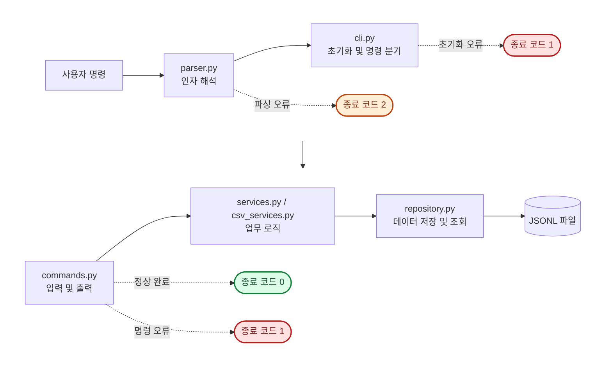

# 나만의 용돈 기입장 CLI

수입과 지출을 파일에 영구 저장하고 터미널에서 관리하는 Python 기반 가계부입니다. 거래 CRUD, 조건 검색, 월별 요약, 예산 및 카테고리 관리, CSV 가져오기·내보내기를 하나의 CLI 애플리케이션으로 제공합니다.

## 주요 기능

| 명령 | 역할 |
| --- | --- |
| `add` | 대화형 입력으로 거래 추가 |
| `list` | 최신 추가순 거래 목록 조회 및 건수 제한 |
| `search` | 기간, 카테고리, 타입, 메모, 태그로 거래 검색 |
| `summary` | 월별 수입·지출·잔액과 지출 상위 카테고리 조회 |
| `budget` | 월별 예산 설정 및 요약에서 사용률·초과 여부 확인 |
| `category` | 카테고리 추가·조회·삭제 |
| `update` | ID로 기존 거래 수정 |
| `delete` | ID로 기존 거래 삭제 |
| `import` | CSV 거래 일괄 등록 |
| `export` | 월 또는 기간에 해당하는 거래를 CSV로 저장 |

## 과제 요구 사항

- 거래, 카테고리, 예산을 각각의 JSONL 파일에 저장해 프로그램 재실행 후에도 유지합니다.
- `list`와 `search`는 제너레이터로 거래를 한 건씩 처리합니다.
- 모델, 저장소, 서비스, CLI 계층을 분리하고 함수와 데이터 구조에 타입 힌트를 적용합니다.
- 공통 오류 처리 데코레이터로 원인과 해결 힌트를 출력하고 오류 시 0이 아닌 종료 코드를 반환합니다.
- 표준 라이브러리만 사용합니다.

## 프로젝트 구조

애플리케이션을 인자 파서, CLI 진입, 명령 실행, 서비스, 저장소, 모델과 공통 오류 처리 역할로 분리했습니다. `parser.py`는 명령어와 옵션, `cli.py`는 초기화와 분기, `commands.py`는 사용자 입출력과 명령 실행을 담당합니다.

```text
B2-1.py-ledger-cli/
├── README.md
├── docs/
│   └── ARCHITECTURE.md     # 계층별 책임과 모듈 의존 관계
├── budget_app/
│   ├── __main__.py        # 실행 진입점
│   ├── parser.py          # 명령과 옵션 정의, 인자 파서 생성
│   ├── cli.py             # CLI 초기화와 명령 분기
│   ├── commands.py        # 명령 실행과 사용자 입력·출력
│   ├── services.py        # 거래·카테고리·예산·요약 업무 규칙
│   ├── csv_services.py    # CSV 가져오기·내보내기 업무 규칙
│   ├── repository.py      # JSONL 데이터 저장·조회
│   ├── models.py          # 거래 데이터 모델
│   ├── validation.py      # 공통 입력 검증
│   └── decorators.py      # 공통 오류 처리
├── data/                  # 실행 시 생성되는 JSONL 데이터
└── tests/                 # 단위·통합 테스트
```

데이터는 거래·카테고리·예산용 파일로 나누고, CLI의 입력·출력과 서비스의 업무 규칙이 섞이지 않도록 계층을 분리합니다.

계층별 책임과 모듈 사이의 의존 관계는 [애플리케이션 구조 문서](docs/ARCHITECTURE.md)에서 자세히 확인할 수 있습니다.

## 실행 흐름



`parser.py`가 명령을 해석하면 `cli.py`가 `commands.py`의 실행 함수를 호출합니다. 실행 함수는 오류를 공통 처리하고 Service와 Repository를 통해 업무 로직과 JSONL 저장·조회를 수행합니다.

## 필요한 환경 및 설정

Python 3.10 이상과 표준 라이브러리만 사용합니다. 별도의 외부 패키지는 필요하지 않습니다.

| 항목 | 내용 |
| --- | --- |
| Python 버전 | 3.10 이상 |
| 외부 의존성 | 없음, 표준 라이브러리만 사용 |
| 내부 저장 형식 | JSONL |
| 기본 데이터 경로 | `./data` |
| 데이터 경로 변경 옵션 | 전역 `--data-dir <path>` 지원 |
| 카테고리가 없을 때 | 거래를 추가할 수 없으며, 먼저 `category add`로 카테고리를 등록해야 함 |
| `update` 입력 방식 | 옵션 기반 |

별도의 설치나 초기화 명령은 필요하지 않습니다. 첫 일반 실행에서 데이터 파일을 자동으로 준비하며, 거래 추가나 CSV 가져오기 전에는 사용할 카테고리를 등록해야 합니다.

## 실행 및 사용 방법

프로젝트 루트에서 다음 명령으로 현재 구현된 CLI 도움말을 확인할 수 있습니다.

```bash
python3 -m budget_app --help
```

인자 없이 `python3 -m budget_app`을 실행하면 기본 `./data` 폴더에 필요한 JSONL 파일을 준비하고 도움말을 출력한 뒤 정상 종료합니다. 다른 위치에 데이터 파일을 준비하려면 다음처럼 실행합니다.

```bash
python3 -m budget_app --data-dir ./my-data
```

`--help`는 사용법만 출력하며 데이터 파일을 생성하지 않습니다.

### 빠른 시작

프로젝트 루트에서 카테고리를 먼저 등록한 뒤 거래를 추가합니다.

```bash
python3 -m budget_app category add
python3 -m budget_app add
python3 -m budget_app list
python3 -m budget_app summary --month 2026-10
```

각 명령의 입력값과 선택 옵션은 `python3 -m budget_app <command> --help`로 확인할 수 있습니다.

### 오류 처리와 종료 코드

| 종료 코드 | 상황 | 처리 방식 |
| --- | --- | --- |
| `0` | 정상 처리 | 명령을 정상적으로 완료합니다. |
| `1` | 명령 실행 중 예상 가능한 입력값·데이터·파일 오류 | Python 스택트레이스 대신 원인과 확인할 내용을 출력하고 종료합니다. |
| `2` | 필수 옵션 누락 등 명령 인자 해석 오류 | Python 표준 `argparse`가 사용법을 출력하고 종료합니다. |
| 즉시 종료하지 않음 | 대화형 입력에서 잘못된 값 입력 | 힌트를 출력하고 해당 값을 다시 입력받습니다. |

명령 실행 오류 메시지 예시:

```text
[오류] 조회 건수는 0보다 큰 정수여야 합니다.
[힌트] 입력값과 데이터 파일을 확인한 뒤 다시 시도하세요.
```

### 거래 추가

거래를 추가하기 전에 사용할 카테고리를 하나 이상 등록해야 합니다.

```bash
python3 -m budget_app category add
python3 -m budget_app add
```

`add`는 날짜, 유형, 카테고리, 금액, 메모, 태그를 순서대로 입력받습니다. 날짜·유형·카테고리·금액이 올바르지 않으면 오류를 보여주고 해당 값을 다시 입력받습니다. 메모와 태그는 입력하지 않아도 되며 태그 여러 개는 쉼표로 구분합니다.

```text
날짜(YYYY-MM-DD): 2026-10-01
타입(income/expense): expense
카테고리: food
금액(양수 정수): 15000
메모(선택): 점심
태그(쉼표로 구분, 없으면 엔터): meal,lunch
[저장 완료] id=<UUID>
```

### 거래 목록 조회

인자를 생략하면 최근에 추가된 거래부터 최대 10건을 출력합니다.

```bash
python3 -m budget_app list
```

출력할 최대 거래 수는 `--limit`으로 지정합니다.

```bash
python3 -m budget_app list --limit 3
```

여기서 최신순은 거래 날짜순이 아니라 파일에 **최근 추가된 순서**를 의미합니다. 저장 파일의 끝에서부터 필요한 줄만 제너레이터로 읽으므로 전체 거래 파일을 한 번에 메모리에 올리지 않습니다. 거래가 없으면 `저장된 거래가 없습니다.`를 출력합니다.

```text
<id> | 2026-10-01 | expense | food | 15000 | 점심
```

### 거래 검색

다음 조건을 선택적으로 조합해 거래를 검색합니다.

| 옵션 | 검색 기준 |
| --- | --- |
| `--from YYYY-MM-DD` | 해당 날짜부터 검색, 시작일 포함 |
| `--to YYYY-MM-DD` | 해당 날짜까지 검색, 종료일 포함 |
| `--category NAME` | 카테고리 정확히 일치 |
| `--type income\|expense` | 거래 유형 정확히 일치 |
| `--q KEYWORD` | 메모에 키워드 포함, 대소문자 구분 없음 |
| `--tag TAG` | 태그 정확히 일치 |

여러 조건을 함께 지정하면 모든 조건을 만족하는 거래만 최근 추가순으로 출력합니다. 조건을 지정하지 않으면 모든 거래를 검색합니다.

```bash
python3 -m budget_app search --from 2026-10-01 --to 2026-10-31
python3 -m budget_app search --category food --type expense --tag meal
python3 -m budget_app search --q dinner
```

검색도 목록 조회와 같은 역방향 제너레이터를 사용합니다. 결과가 없으면 `검색 결과가 없습니다.`를 출력합니다.

### 월별 요약

`--month`로 지정한 달의 총 수입, 총 지출, 잔액과 지출 카테고리 순위를 출력합니다. `--top`을 생략하면 상위 3개 카테고리를 보여주며, 0보다 큰 정수만 지정할 수 있습니다.

```bash
python3 -m budget_app summary --month 2026-10 --top 3
```

```text
총 수입: 3000000원
총 지출: 215000원
잔액: 2785000원

지출 TOP 3
1) rent 150000원
2) food 45000원
3) transport 20000원
```

해당 월에 거래가 하나도 없으면 `데이터 없음: YYYY-MM`을 출력합니다. 수입 거래만 있는 달은 합계를 표시한 뒤 `지출 내역이 없습니다.`를 출력합니다. 해당 월에 예산이 설정되어 있으면 사용률과 예산 이내·초과 상태를 함께 보여주고, 초과 시 경고를 출력합니다.

### 월별 예산 설정

월과 0보다 큰 금액을 지정해 예산을 저장합니다.

```bash
python3 -m budget_app budget set --month 2026-10 --amount 500000
```

```text
[저장 완료] 2026-10 예산 500000원
```

같은 달의 예산을 다시 설정하면 이전 금액을 새 금액으로 교체합니다. 예산은 `budgets.jsonl`에 저장되므로 프로그램을 종료하고 다시 실행해도 유지됩니다.

예산 500,000원과 지출 250,000원이 있는 달의 요약에는 다음 내용이 추가됩니다.

```text
예산: 500000원 (사용률 50.0%)
예산 상태: 이내
```

지출이 예산보다 크면 다음과 같이 초과 금액을 안내합니다.

```text
예산: 200000원 (사용률 125.0%)
예산 상태: 초과
[경고] 예산을 50000원 초과했습니다.
```

### 거래 수정과 삭제

`update`는 ID와 변경할 필드만 옵션으로 전달합니다. 지정하지 않은 필드는 기존 값을 유지하며, 하나 이상의 변경 필드가 필요합니다.

```bash
python3 -m budget_app update --id TRANSACTION_ID --amount 20000
python3 -m budget_app update --id TRANSACTION_ID --date 2026-10-02 --category transport
```

지원하는 변경 옵션은 `--date`, `--type`, `--category`, `--amount`, `--memo`, `--tags`입니다. 메모나 태그를 비우려면 빈 문자열을 전달합니다.

```bash
python3 -m budget_app update --id TRANSACTION_ID --memo "" --tags ""
```

거래는 ID로 삭제합니다.

```bash
python3 -m budget_app delete --id TRANSACTION_ID
```

수정·삭제 시 `transactions.jsonl` 전체를 기존 순서대로 다시 씁니다. 현재 필수 범위에는 임시 파일을 사용한 원자적 교체가 포함되지 않습니다.

### 카테고리 관리

카테고리를 추가하면 대화형으로 이름을 입력받아 저장합니다.

```bash
python3 -m budget_app category add
```

등록된 카테고리를 저장 순서대로 조회합니다.

```bash
python3 -m budget_app category list
```

카테고리를 삭제하면 대화형으로 이름을 입력받습니다. 거래에서 사용 중인 카테고리는 삭제할 수 없습니다.

```bash
python3 -m budget_app category remove
```

다른 데이터 폴더를 사용할 때는 최상위 명령 앞에 옵션을 지정합니다.

```bash
python3 -m budget_app --data-dir ./my-data category list
```

### CSV 가져오기

CSV에 적힌 카테고리는 가져오기 전에 `category add`로 등록되어 있어야 합니다. 다음 명령으로 UTF-8 CSV의 거래를 일괄 등록합니다.

```bash
python3 -m budget_app import --from ./input.csv
```

정상 행은 기존 `add`와 같은 규칙으로 검증한 뒤 새로운 UUID를 생성해 저장합니다. 잘못된 행은 이유와 줄 번호를 출력하고 다음 행을 계속 처리합니다.

```text
[건너뜀] 3번째 줄: 날짜는 실제 달력에 존재하는 날짜여야 합니다.
[완료] imported=2, skipped=1
```

파일을 찾을 수 없거나 UTF-8이 아니거나 필수 헤더가 없으면 파일 전체를 처리할 수 없으므로 오류 메시지를 출력하고 종료 코드 1로 종료합니다.

### CSV 내보내기

월 또는 날짜 범위 중 하나를 지정해 거래를 UTF-8 CSV로 저장합니다.

```bash
python3 -m budget_app export --out ./october.csv --month 2026-10
python3 -m budget_app export --out ./period.csv --from 2026-10-01 --to 2026-10-31
```

날짜 범위는 양 끝 날짜를 포함하며 `--from` 또는 `--to` 한쪽만 지정할 수도 있습니다. `--month`와 날짜 범위는 함께 사용할 수 없습니다. 기간 조건을 하나도 지정하지 않으면 오류로 종료합니다.

```text
[완료] october.csv (12 records)
```

내보낸 거래는 최근 추가된 순서로 기록됩니다. 결과가 없어도 6개 열의 헤더가 있는 CSV를 만들고 `0 records`를 출력합니다. `--out`에 이미 존재하는 파일을 지정하면 기존 내용을 덮어씁니다.

## 데이터 저장

첫 일반 실행에서 다음 세 파일이 자동 생성됩니다. 이미 존재하는 파일은 초기화 과정에서 덮어쓰지 않습니다.

```text
data/
├── transactions.jsonl
├── categories.jsonl
└── budgets.jsonl
```

JSONL은 한 줄마다 하나의 JSON 객체를 UTF-8로 저장하는 형식입니다. 현재 사용하는 레코드 구조는 다음과 같습니다.

| 파일 | 한 줄의 JSON 객체 |
| --- | --- |
| `transactions.jsonl` | `{"id": "...", "type": "expense", "date": "2026-10-01", "amount": 15000, "category": "food", "memo": "점심", "tags": ["meal"]}` |
| `categories.jsonl` | `{"name": "food"}` |
| `budgets.jsonl` | `{"month": "2026-10", "amount": 500000}` |

`Transaction`은 다음 필드와 검증 규칙을 사용합니다.

| 필드 | 타입 | 검증 규칙 |
| --- | --- | --- |
| `id` | `str` | UUID 형식의 거래 식별자 |
| `type` | `income` 또는 `expense` | 두 값 중 하나만 허용 |
| `date` | `str` | `YYYY-MM-DD` 형식이며 실제 존재하는 날짜 |
| `amount` | `int` | 0보다 큰 정수 |
| `category` | `str` | 비어 있지 않은 이름 |
| `memo` | `str` | 선택 입력, 기본값은 빈 문자열 |
| `tags` | `list[str]` | 선택 입력, 기본값은 빈 목록 |

카테고리 목록은 `category` 명령으로 관리할 수 있으며, 거래 추가 시 등록된 카테고리만 사용할 수 있습니다.

## CSV 가져오기·내보내기 형식

`import`와 `export`는 UTF-8 인코딩과 헤더를 포함한 같은 CSV 형식을 사용합니다. `export`는 아래 6개 열을 모두 기록합니다. `import`는 `memo`, `tags`가 선택 사항입니다.

| 열 | 필수 | 형식 및 설명 |
| --- | --- | --- |
| `date` | 예 | `YYYY-MM-DD` |
| `type` | 예 | `income` 또는 `expense` |
| `category` | 예 | 등록된 카테고리 |
| `amount` | 예 | 양의 정수 |
| `memo` | 아니요 | 문자열, 열을 생략하거나 값을 비울 수 있음 |
| `tags` | 아니요 | 쉼표로 구분한 문자열, 열을 생략하거나 값을 비울 수 있음 |

`tags`에 여러 값이 있으면 CSV 구분 쉼표와 구별되도록 필드를 큰따옴표로 감쌉니다.

```csv
date,type,category,amount,memo,tags
2026-10-01,expense,food,15000,점심,"meal,lunch"
```

필수 열은 `date`, `type`, `category`, `amount`입니다. 각 행의 필수값이 비어 있거나 기존 거래 규칙을 통과하지 못하면 해당 행만 건너뜁니다.

## 주요 설계 선택과 한계점

### 1. 저장 형식: JSONL과 CSV 분리

**선택**

- 애플리케이션 내부 데이터는 JSONL로 저장합니다.
- 외부 데이터 가져오기·내보내기에는 CSV를 사용합니다.

**이유**

- JSONL은 한 줄에 한 레코드를 저장하므로 거래를 순차적으로 처리할 수 있습니다.
- `tags` 같은 목록도 별도 변환 없이 JSON 구조로 보존할 수 있습니다.
- CSV는 스프레드시트 등 다른 도구에서 쉽게 열고 편집할 수 있습니다.

**한계**

- JSONL은 파일 중간의 특정 거래를 바로 수정하기 어렵습니다.
- 검색 인덱스가 없어 거래가 많아질수록 조건 검색이 느려질 수 있습니다.
- CSV에서는 태그 목록을 문자열로 변환하고, 가져올 때 각 필드를 다시 알맞은 타입으로 해석해야 합니다.

### 2. 데이터 처리: 조회는 스트리밍, 변경은 전체 재작성

| 작업 | 처리 방식 |
| --- | --- |
| `list` | 파일 끝에서 역방향으로 읽고 필요한 건수에 도달하면 중단 |
| `search` | 제너레이터로 거래를 한 건씩 읽으며 조건 검사 |
| `update`, `delete` | ID와 변경값을 검증한 뒤 전체 파일을 기존 순서대로 재작성 |

**얻는 점**

- `list`와 `search`는 전체 거래를 한 번에 메모리에 올리지 않습니다.
- 존재하지 않는 ID나 잘못된 변경값은 파일을 수정하기 전에 차단합니다.

**한계**

- 데이터베이스 인덱스가 없어 거래가 많아질수록 조건 검색이 느려질 수 있습니다.
- 단일 순차 파일에서는 특정 거래만 바로 수정하거나 삭제하기 어려워 전체 파일을 다시 써야 하며, 저장된 거래가 많을수록 비용이 증가합니다. 이는 JSONL 고유의 제약이 아니며 CSV도 같습니다.
- 임시 파일을 이용한 원자적 교체를 지원하지 않아, 재작성 중 프로그램이 강제 종료되면 파일이 불완전해질 수 있습니다.

### 3. 오류 처리: 공통 처리와 CSV 부분 성공

**선택**

- CLI의 예상 가능한 입력·파일 오류는 공통 데코레이터가 처리합니다.
- CSV 가져오기는 정상 행을 즉시 저장하고, 잘못된 행만 건너뛰는 부분 성공 방식을 사용합니다.

**처리 결과**

- 개별 행 오류는 줄 번호와 이유를 출력한 뒤 다음 행을 계속 처리합니다.
- 완료 후 `imported`와 `skipped` 건수를 출력합니다.
- 파일 없음, 인코딩 오류, 필수 헤더 누락처럼 전체 처리가 불가능하면 종료 코드 `1`로 종료합니다.

**한계**

- 가져오기 도중 오류가 발생해도 이미 저장된 정상 행을 되돌리는 롤백은 제공하지 않습니다.

## 정상 동작 확인

프로젝트 루트에서 전체 자동 테스트를 실행합니다.

```bash
python3 -m unittest discover -s tests -v
```

테스트는 명령 및 도움말 연결, 거래 CRUD와 검색, 세 데이터 파일의 영속성, 월별 요약과 예산, CSV 가져오기·내보내기, 오류 메시지와 종료 코드, 전체 사용자 흐름을 확인합니다. 현재 테스트 88개가 모두 통과합니다. 실제 CLI 흐름은 위의 빠른 시작 순서로 카테고리를 등록하고 거래를 추가한 뒤 `list`와 `summary` 출력을 확인할 수 있습니다.
