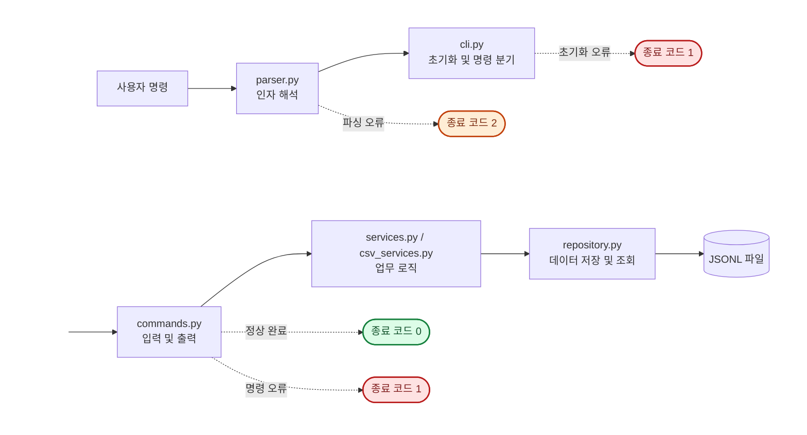

# 나만의 용돈 기입장 CLI

수입과 지출을 JSONL 파일에 저장하고 터미널에서 관리하는 Python 가계부입니다. 거래 관리와 검색, 월별 요약, 예산·카테고리 관리, CSV 가져오기·내보내기를 지원합니다.

## 주요 기능

- 거래 추가·조회·검색·수정·삭제
- 월별 수입·지출·잔액 및 지출 카테고리 순위 조회
- 월별 예산 설정과 사용률·초과 금액 확인
- 카테고리 추가·조회·삭제
- UTF-8 CSV 가져오기·내보내기
- JSONL 기반 영구 저장과 제너레이터 기반 조회
- 원인과 해결 힌트를 제공하는 공통 오류 처리

## 프로젝트 구조

```text
B2-1.py-ledger-cli/
├── budget_app/
│   ├── __main__.py        # 실행 진입점
│   ├── parser.py          # 명령과 옵션 정의
│   ├── cli.py             # 초기화와 명령 분기
│   ├── commands.py        # 사용자 입력과 출력
│   ├── services.py        # 거래·카테고리·예산 업무 규칙
│   ├── csv_services.py    # CSV 가져오기·내보내기
│   ├── repository.py      # JSONL 저장과 조회
│   ├── models.py          # 거래 모델
│   ├── validation.py      # 입력값 검증
│   └── decorators.py      # 공통 오류 처리
├── data/                  # JSONL 데이터
├── docs/                  # 설계 및 과제 문서
└── tests/                 # 단위·통합 테스트
```

계층별 책임과 의존 관계는 [애플리케이션 구조 문서](docs/ARCHITECTURE.md)를 참고하세요.

## 실행 흐름



`parser.py`가 명령을 해석하면 `cli.py`가 `commands.py`의 실행 함수를 호출합니다. 실행 함수는 오류를 공통 처리하고 Service와 Repository를 통해 업무 로직과 JSONL 저장·조회를 수행합니다.

## 실행 환경

- Python 3.10 이상
- 외부 패키지 없음

프로젝트 루트에서 도움말을 확인합니다.

```bash
python3 -m budget_app --help
```

인자 없이 실행하면 기본 `./data`에 데이터 파일을 준비하고 도움말을 출력합니다.

```bash
python3 -m budget_app
```

다른 데이터 폴더를 사용하려면 하위 명령 앞에 `--data-dir`을 지정합니다.

```bash
python3 -m budget_app --data-dir ./my-data list
```

## 빠른 시작

거래에 사용할 카테고리를 먼저 등록한 뒤 거래를 추가합니다.

```bash
python3 -m budget_app category add
python3 -m budget_app add
python3 -m budget_app list
python3 -m budget_app summary --month 2026-10
```

`category add`와 `add`는 필요한 값을 대화형으로 입력받습니다. 각 명령의 옵션은 다음과 같이 확인할 수 있습니다.

```bash
python3 -m budget_app search --help
```

## 명령어

| 기능 | 명령 예시 |
| --- | --- |
| 거래 추가 | `python3 -m budget_app add` |
| 최근 거래 조회 | `python3 -m budget_app list --limit 10` |
| 거래 검색 | `python3 -m budget_app search --category food --type expense` |
| 월별 요약 | `python3 -m budget_app summary --month 2026-10 --top 3` |
| 월별 예산 설정 | `python3 -m budget_app budget set --month 2026-10 --amount 500000` |
| 거래 수정 | `python3 -m budget_app update --id TRANSACTION_ID --amount 20000` |
| 거래 삭제 | `python3 -m budget_app delete --id TRANSACTION_ID` |
| 카테고리 추가 | `python3 -m budget_app category add` |
| 카테고리 조회 | `python3 -m budget_app category list` |
| 카테고리 삭제 | `python3 -m budget_app category remove` |
| CSV 가져오기 | `python3 -m budget_app import --from ./input.csv` |
| CSV 내보내기 | `python3 -m budget_app export --out ./output.csv --month 2026-10` |

### 거래 추가와 관리

`add`는 날짜, 유형, 카테고리, 금액, 메모, 태그를 차례로 입력받습니다. 날짜·유형·카테고리·금액이 올바르지 않으면 해당 값을 다시 입력받습니다. 메모와 태그는 생략할 수 있으며 태그 여러 개는 쉼표로 구분합니다.

```text
날짜(YYYY-MM-DD): 2026-10-01
타입(income/expense): expense
카테고리: food
금액(양수 정수): 15000
메모(선택): 점심
태그(쉼표로 구분, 없으면 엔터): meal,lunch
[저장 완료] id=<UUID>
```

`list`는 최근에 추가된 거래부터 기본 10건을 출력합니다. 여기서 최신순은 거래 날짜가 아니라 파일에 추가된 순서입니다.

`update`는 ID와 변경할 필드를 옵션으로 받습니다. 지원 옵션은 `--date`, `--type`, `--category`, `--amount`, `--memo`, `--tags`이며 하나 이상을 지정해야 합니다. 메모나 태그를 비우려면 빈 문자열을 전달합니다.

```bash
python3 -m budget_app update --id TRANSACTION_ID --date 2026-10-02 --category transport
python3 -m budget_app update --id TRANSACTION_ID --memo "" --tags ""
```

### 거래 검색

검색 조건을 여러 개 지정하면 모든 조건을 만족하는 거래를 최근 추가순으로 출력합니다. 조건이 없으면 전체 거래를 조회합니다.

| 옵션 | 조건 |
| --- | --- |
| `--from YYYY-MM-DD` | 시작일 이상 |
| `--to YYYY-MM-DD` | 종료일 이하 |
| `--category NAME` | 카테고리 일치 |
| `--type income\|expense` | 거래 유형 일치 |
| `--q KEYWORD` | 메모에 키워드 포함, 대소문자 구분 없음 |
| `--tag TAG` | 태그 일치 |

```bash
python3 -m budget_app search --from 2026-10-01 --to 2026-10-31
python3 -m budget_app search --category food --type expense --tag meal
```

### 월별 요약과 예산

`summary`는 지정한 달의 총수입, 총지출, 잔액과 지출 카테고리 순위를 출력합니다. `--top`의 기본값은 `3`입니다. 예산이 설정된 달에는 사용률과 초과 여부도 함께 표시합니다.

```bash
python3 -m budget_app budget set --month 2026-10 --amount 500000
python3 -m budget_app summary --month 2026-10 --top 5
```

### 카테고리 관리

카테고리 추가와 삭제는 이름을 대화형으로 입력받습니다. 거래에 사용 중인 카테고리는 삭제할 수 없습니다.

```bash
python3 -m budget_app category add
python3 -m budget_app category list
python3 -m budget_app category remove
```

## CSV 가져오기·내보내기

### CSV 형식

가져오기와 내보내기는 UTF-8 인코딩과 헤더를 사용합니다.

| 열 | 필수 | 형식 |
| --- | --- | --- |
| `date` | 예 | 실제 존재하는 `YYYY-MM-DD` 날짜 |
| `type` | 예 | `income` 또는 `expense` |
| `category` | 예 | 등록된 카테고리 |
| `amount` | 예 | 0보다 큰 정수 |
| `memo` | 아니요 | 문자열 |
| `tags` | 아니요 | 쉼표로 구분한 문자열 |

```csv
date,type,category,amount,memo,tags
2026-10-01,expense,food,15000,점심,"meal,lunch"
```

### 가져오기

CSV에서 사용하는 카테고리는 미리 등록해야 합니다. 올바른 행에는 새 UUID를 부여해 저장하고, 잘못된 행은 줄 번호와 이유를 출력한 뒤 건너뜁니다. 파일 없음, 인코딩 오류, 필수 헤더 누락처럼 전체 처리가 불가능한 오류는 종료 코드 `1`을 반환합니다.

```bash
python3 -m budget_app import --from ./input.csv
```

### 내보내기

월 또는 날짜 범위를 지정해 CSV로 저장합니다. 날짜 범위는 양 끝을 포함하며 `--from`과 `--to` 중 하나만 지정할 수도 있습니다. `--month`와 날짜 범위는 함께 사용할 수 없습니다.

```bash
python3 -m budget_app export --out ./october.csv --month 2026-10
python3 -m budget_app export --out ./period.csv --from 2026-10-01 --to 2026-10-31
```

결과가 없어도 헤더가 있는 CSV를 생성합니다. 출력 파일이 이미 있으면 덮어씁니다.

## 데이터 저장

기본 데이터 폴더는 `./data`입니다. 일반 명령을 처음 실행할 때 다음 파일이 없으면 자동으로 생성하며, 기존 파일은 덮어쓰지 않습니다.

```text
data/
├── transactions.jsonl
├── categories.jsonl
└── budgets.jsonl
```

각 파일은 한 줄에 JSON 객체 하나를 UTF-8로 저장합니다.

| 파일 | 레코드 예시 |
| --- | --- |
| `transactions.jsonl` | `{"id":"...","type":"expense","date":"2026-10-01","amount":15000,"category":"food","memo":"점심","tags":["meal"]}` |
| `categories.jsonl` | `{"name":"food"}` |
| `budgets.jsonl` | `{"month":"2026-10","amount":500000}` |

`list`와 `search`는 제너레이터로 거래를 한 건씩 처리하므로 전체 거래 파일을 한 번에 메모리에 올리지 않습니다.

## 오류 처리와 제약 사항

| 종료 코드 | 의미 |
| --- | --- |
| `0` | 정상 완료 |
| `1` | 입력값·데이터·파일 처리 오류 |
| `2` | 필수 옵션 누락 등 명령 인자 오류 |

명령 실행 중 예상 가능한 오류는 스택트레이스 대신 원인과 확인할 내용을 출력합니다. 대화형 입력 오류는 종료하지 않고 해당 값을 다시 입력받습니다.

- `update`와 `delete`는 거래 파일 전체를 다시 쓰며 원자적 파일 교체를 지원하지 않습니다.
- 검색 인덱스가 없어 데이터가 많아질수록 검색과 파일 재작성 비용이 증가합니다.
- CSV 가져오기는 정상 행을 즉시 저장하므로 이후 행에서 오류가 발생해도 앞서 저장한 행을 되돌리지 않습니다.

## 테스트

프로젝트 루트에서 전체 테스트를 실행합니다.

```bash
python3 -m unittest discover -s tests -v
```

테스트는 명령 연결, 거래 CRUD와 검색, 데이터 영속성, 월별 요약과 예산, CSV 가져오기·내보내기, 오류 처리와 전체 사용자 흐름을 검증합니다.
